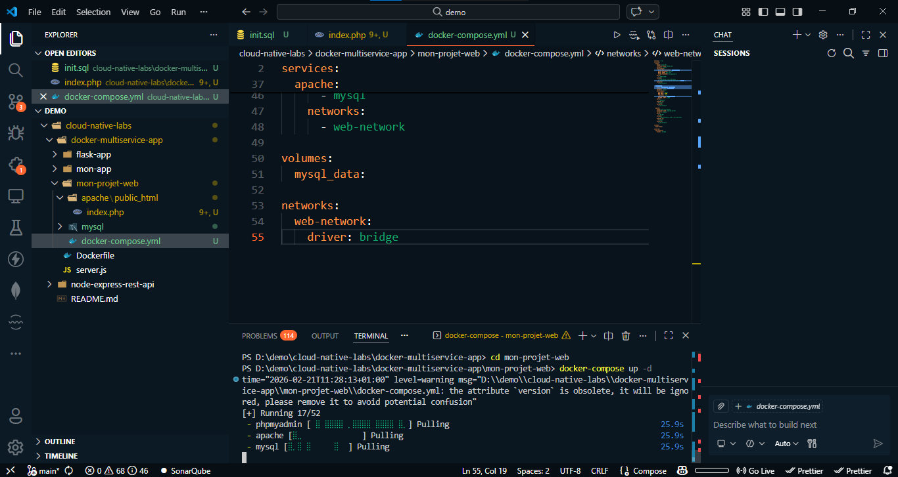
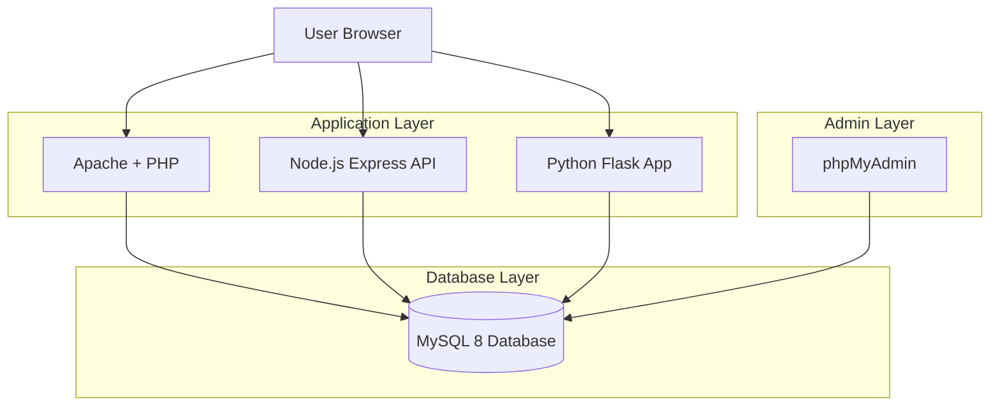

  

  

🐳 Docker Multi-Service Web Stack
=================================

📌 Overview
-----------

**docker-multiservice-app** is a full-stack containerized web environment built to demonstrate modern DevOps fundamentals using Docker and Docker Compose.

This project showcases:

*   Containerization of multiple applications
*   Service orchestration with Docker Compose
*   Persistent database volumes
*   Inter-container networking
*   Multi-language web stack integration
    
* * *

🏗 System Architecture
----------------------

The application runs multiple services inside isolated containers:

*   🟢 Node.js (HTTP server)
*   🟢 Express.js API
*   🟢 Python Flask application
*   🟢 MySQL 8 database
*   🟢 Apache + PHP 
*   🟢 phpMyAdmin interface
*   🟢 Docker bridge network
*   🟢 Persistent storage (Docker volume)
    

* * *

🧠 Architecture Diagram (Mermaid)
---------------------------------

* * *

📂 Project Structure
--------------------

    docker-multiservice-app/
    │
    ├── mon-app-node/          # Basic Node.js HTTP server
    ├── mon-app/               # Express.js application
    ├── flask-app/             # Python Flask app
    │
    ├── apache/
    │   └── public_html/
    │       └── index.php
    │
    ├── mysql/
    │   └── init/
    │       └── init.sql
    │
    └── docker-compose.yml
    

* * *

🚀 Getting Started
------------------

### 1️⃣ Clone the repository

    git clone https://github.com/your-username/docker-multiservice-app.git
    cd docker-multiservice-app
    

* * *

### 2️⃣ Start all services

    docker compose up -d
    

* * *

### 3️⃣ Access the applications

## 🌐 Access the Applications

| Service | Description | URL |
|----------|-------------|------|
| 🖥️ Apache + PHP | Main web interface | http://localhost |
| 🗄️ phpMyAdmin | Database management | http://localhost:8080 |
| ⚡ Express API | Node.js backend API | http://localhost:3000 |
| 🐍 Flask App | Python backend service | http://localhost:5000 |

* * *

🔐 Database Configuration
-------------------------

    Host: mysql
    Database: ma_base
    User: mon_user
    Password: mon_password
    
    Root:
    User: root
    Password: rootpassword
    

* * *

📦 DevOps Concepts Demonstrated
-------------------------------

*   Docker image building
    
*   Multi-container orchestration
    
*   Service dependency management
    
*   Volume persistence
    
*   Network isolation
    
*   Environment variables configuration
    
*   Database initialization scripts
    

* * *

🛠 Tech Stack
-------------

<table>
  <tr>
    <th>Category</th>
    <th>Technology</th>
    <th>Icon</th>
  </tr>

  <tr>
    <td align="center">Containerization</td>
    <td align="center">Docker</td>
    <td align="center">
      
    </td>
  </tr>

  <tr>
    <td align="center">Orchestration</td>
    <td align="center">Docker Compose</td>
    <td align="center">
      
    </td>
  </tr>

  <tr>
    <td align="center">Backend</td>
    <td align="center">Node.js</td>
    <td align="center">
      
    </td>
  </tr>

  <tr>
    <td align="center">Backend Framework</td>
    <td align="center">Express.js</td>
    <td align="center">
      
    </td>
  </tr>

  <tr>
    <td align="center">Backend</td>
    <td align="center">Python</td>
    <td align="center">
      
    </td>
  </tr>

  <tr>
    <td align="center">Backend Framework</td>
    <td align="center">Flask</td>
    <td align="center">
      
    </td>
  </tr>

  <tr>
    <td align="center">Database</td>
    <td align="center">MySQL</td>
    <td align="center">
      
    </td>
  </tr>

  <tr>
    <td align="center">Web Server</td>
    <td align="center">Apache</td>
    <td align="center">
      
    </td>
  </tr>

  <tr>
    <td align="center">Database Admin</td>
    <td align="center">phpMyAdmin</td>
    <td align="center">
      
    </td>
  </tr>

</table>

    

* * *

📈 Why This Project Matters
---------------------------

This project demonstrates practical understanding of:

*   Full-stack deployment
    
*   Container networking
    
*   Production-ready service orchestration
    
*   Backend integration across multiple technologies
    
*   Real-world DevOps workflow
    

* * *

👨‍💻 Author
------------

**Ayoub Aguezar**  
Full-Stack Developer | DevOps Enthusiast  
Morocco 🇲🇦

* * *

* * *

🔥 BONUS – Badges (pour rendre ton README encore plus pro)
==========================================================

Ajoute en haut :

    
    
    
    
    
    

* * *

Si tu veux maintenant :

*   💎 Une version encore plus “impression recruteur US”
    
*   🎯 Une version optimisée pour ATS / CV tech
    
*   📊 Un diagramme plus avancé style microservices
    
*   🚀 Une section “Future Improvements” pour montrer vision ingénieur
    

Dis-moi 👌
